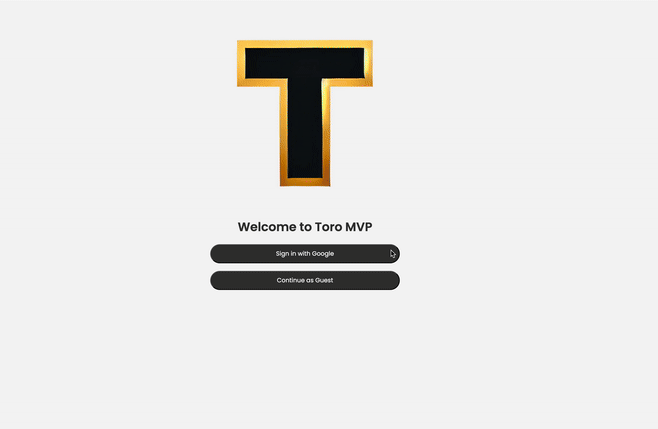

<u>Oveview:</u>

Toro MVP is a lightweight market tracker designed to track trending stocks, build a personalized watchlist, and receive alerts when prices hit target levels

<u>Features:</u>
  - Browse top 10 trending tickers from the Yahoo Finance API
  - Search and add companies to a custom watchlist
  - Set price alerts for notification of target conditions
  - Visualize trends with mini charts and detailed analytics
  - Predict future prices using a TensorFlow.js linear regression model (RMSE quality metric)
  - Sign in securely with Google authentication via Firebase

<u>Navigation Demo:</u>

<u>Tech Stack:</u>

Frontend:
  React.js, Axios, Recharts, TensorFlow.js

Backend:
  Node.js, Express, MongoDB/mongoose, Yahoo Finance API/yahoo-finance2, Firebase, AWS EC2

<u>Installation & Setup:</u>
  - Clone the repo
  - npm install
  - Replace variables in example.env and rename to .env
  - Start the server and client with npm run dev
  - The app will be available at http://localhost:3000

